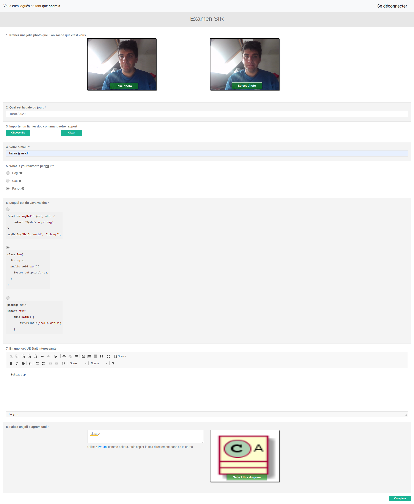

# ExamSurveyJS

This project is an integration of the [SurveyJS](https://surveyjs.io/Overview/Library) library for the definition of computer science exams at the [University of Rennes 1](https://www.univ-rennes1.fr/).

I developed or integrated three specific modules for surveyjs library:

- a *photo* module to allow to define a question that takes a picture with the webcam in order to check who is composing.
- a UML module to answer questions asking for the definition of an uml diagram using the plantuml/liveuml syntax.
- a module in order to be able to use markdown having included the support of highlightjs in order to have code with syntax highlighting in the questions, for example in questions of choice.

As it is, the front end makes a simple request to the back to get the json on /exam.json. It also query the back to get the cas information (who is currently logged in). 

I also provide an implementation of a Go backend with [cas](https://apereo.github.io/cas/4.2.x/protocol/CAS-Protocol.html) integration for student authentication, IP filtering to access the exam only from specific  rooms and a scheduler to open the exam for a specific period. 
This backend is [here](). 

## Json as a DSL for your survey. 

As a result, you have a json file that could be used as a simple language to define your exam and its parameter.

To create the json, I use a simple node js to use the [template literal](https://developer.mozilla.org/en-US/docs/Web/JavaScript/Reference/template_strings) . They have many features, variable interpolation among others, but most importantly for this question, they can be multiline.

```js
var exam = {
    "title" : "Examen SIR",
    "questions": [
      {
        "name": "photo",
        // New type of widget to take photo
        "type": "photocapture",
        "title": "Prenez une jolie photo que l' on sache que c'est vous",
        "isRequired:": true
    },
   {
            "name": "birthdate",
            "type": "text",
            "inputType": "date",
            "title": "Quel est la date du jour:",
            "isRequired": true
        },         {
          "type": "file",
          "title": "Importer un fichier doc contenant votre rapport",
          "name": "rapport",
          "storeDataAsText": true,
          "showPreview": false,
          "maxSize": 102400
      }, {
            "name": "email",
            "type": "text",
            "inputType": "email",
            "title": "Votre e-mail:",
            "placeHolder": "jon.snow@nightwatch.org",
            "isRequired": true,
            "validators": [
                {
                    "type": "email"
                }
            ]
        },
        {
          "type": "radiogroup",
          "hasOther": false,
          "isRequired": true,
          "name": "favoritePet",
          "title": "What is your favorite pet  ?",
          "choices": [
              {
                  "value": "dog",
                  "text": "Dog: "
              }, {
                  "value": "cat",
                  "text": "Cat: "
              }, {
                  "value": "parrot",
                  "text": "Parrot "
              }
          ]
      },
      {
        "type": "radiogroup",
        "hasOther": false,
        "isRequired": true,
        "name": "estcedujava",
        "title": "Lequel est du Java valide:",
        "choices": [
       {
        "value": "js",
      // New type of widget to support highlightjs
        "text": `\`\`\`js
function sayHello (msg, who) {
    return \`\${who} says: msg\`;
}
sayHello("Hello World", "Johnny");
\`\`\``
      },
      {
        "value": "java",
        "text": `\`\`\`java
class Foo{
  String a;
  public void bar(){
    System.out.println(a);
  }
}
\`\`\``
      },
      {
        "value": "go",
        "text": `\`\`\`go
package main
import "fmt"
    func main() {
        fmt.Println("hello world")
    }
\`\`\``
      }
    ]
    },


        {
            "type": "editor",
            "name": "feedbackue",
            "title": "En quoi cet UE était interessante"

        },
        {
          "name": 'uml',
        // New type of widget to support plantuml
          "type": 'uml',
          "title": 'Faites un joli diagram uml',
          "isRequired": true
      },

    ],
    completedHtml: "<p><h4>Merci pour avoir compléter ce projet</h4></p>"

}

console.log(JSON.stringify(exam));

```

The following json will build the following exam




In general, surveyjs library is highly configurable, please read the [documentation](https://surveyjs.io/Documentation/Library) and [examples](https://surveyjs.io/Examples/Library) to find out how to create your exam. SurveyJS provide also a [creator](https://surveyjs.io/Overview/Survey-Creator): It is an online visual survey creator and form builder. You can export the json file of your exam at the end. 


## Deployement

An example of deployment is available on the backend Readme.md file.

## Development

This project was generated with [Angular CLI](https://github.com/angular/angular-cli) version 9.1.0.


## Build

Run `ng build` to build the project. The build artifacts will be stored in the `dist/` directory. Use the `--prod` flag for a production build.


## Development server


To access the cas, you ofen have to use a University subdomain. Create a fake DNS entry for your application in your /etc/hosts. 

```txt
127.0.0.1	monservice.univ-rennes1.fr
```

Run `ng serve  --host monservice.univ-rennes1.fr --proxy-config proxy.conf.json` for a dev server. Navigate to `http://monservice.univ-rennes1.fr:4200/`. The app will automatically reload if you change any of the source files.
